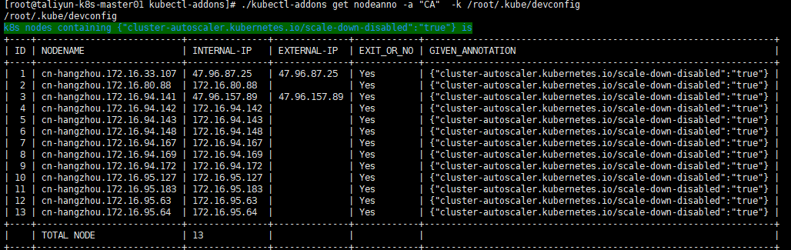
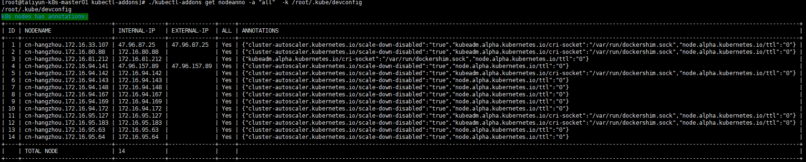
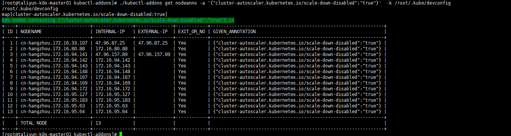

# kubectl-addons

---

### Purpose of writing this project
-  First
I find it is too hard to use cmd kubectl to get node annotation in k8s cluster when k8s
cluster has Tens of thousands Nodes in K8s cluster.if we wanna to get some node's annotation ,we alway use cmd` kubectl --kubeconfig=/root/.kube/devconfig  describe nodes |grep Annotation
` in shell, it takes too many times.


- Second 
I am studying golang language recently,so i wanna to create a golang project to practicc
programming by golang ,in this project i use the package like [cobra](https://github.com/spf13/cobra) ,[go-client](https://github.com/kubernetes/client-go) , [color](https://github.com/fatih/color) and so on.

### How to use it 


Follow the way cobra defines commands, use the Parent Commands、subcommands flags.

`./kubectl-addons get nodeanno -a "all"  -k /root/.kube/devconfig ` 

kubectl-addons is my proceject name,and i use it as Parent Commands, like `kubectl` style,
`get` is SubCommands like list ,nodeanno is the children command of  'get' cmd.


#### Example:
- use can use `help` to get some help informations.
```shell 

[root@taliyun-k8s-master01 kubectl-addons]# ./kubectl-addons get nodeanno --help
get node Annotation

Usage:
  kubectl-addons get nodeanno [flags]

Examples:
 1.kubect-addons get nodeanno -a "CA"  --> to get ClusterAutoSacler node that not to clam down 
2. kubectl-addons get nodeanno -a "All" --> to get all Node Annotation
3. kubectl-addons get nodeanno -a '{"flannel.alpha.coreos.com/backend-type":"vxlan"}'  --> to list given Annotation Node  
4. kubectl-addons get nodeanno -a '{"cluster-autoscaler.kubernetes.io/scale-down-disabled":"true"}' -k C:/Users/39295/kube/config 

Flags:
  -a, --annotation string    get nodeanno  -a '{"flannel.alpha.coreos.com/backend-type":"vxlan"}'
                             ,to list gien node
  -h, --help                help for nodeanno

Global Flags:
      --config string        config file (default is $HOME/.kubectl-addons.yaml)
  -k, --kubeconfig string    -k C:/Users/39295/kube/config (default "/root/.kube/config")
  -n, --namespace string     -n default (default "default")
  -l, --nodeslector string   -l type=others
      --viper                use Viper for configuration (default true)

```

#### Some Screenshots

- get cluster-auto-scaler node that not be scaled down .




- get all node's annotation in k8s  cluster




- get some specify annotation by user

